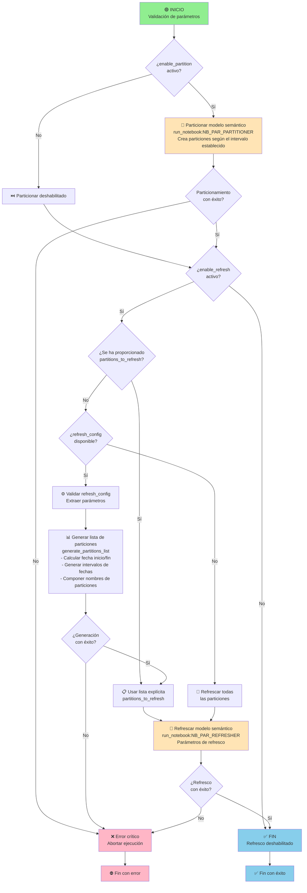

# NB_PAR_ORCHESTRATOR

[](https://www.python.org/)

## 📋 Resumen

El cuaderno **NB_PAR_ORCHESTRATOR** es el orquestador principal del flujo de trabajo para la gestión de particiones y refresco de datos en conjuntos de datos de Power BI dentro de Microsoft Fabric. Este cuaderno coordina la creación automática de particiones y la actualización selectiva de tablas o particiones según las configuraciones definidas por el usuario.

---

## ➡️ Parámetros de entrada

### Configuración básica

| Parámetro | Tipo | Descripción | Ejemplo |
|-----------|------|-------------|---------|
| `workspace_id` | string | GUID del área de trabajo de Microsoft Fabric | `"dc1b17ac-1d39-4be3-a848-45c8a55c05f1"` |
| `dataset_id` | string | GUID del modelo semántico de Power BI | `"0e4e85ca-f446-44b6-bf18-2a9114668242"` |

### Parámetros de particionamiento

| Parámetro | Tipo | Descripción | Ejemplo |
|-----------|------|-------------|---------|
| `enable_partition` | boolean | Habilita/deshabilita la creación de particiones | `True` / `False` |
| `partitions_config` | string (JSON) | Configuración de las particiones a crear | Ver tabla abajo |

**Ejemplo de `partitions_config`:**
```json
[
  {
    "table": "Sales",
    "first_date": "20200101",
    "partition_by": "Order Date",
    "interval": "QUARTER"
  }
]
```

| Campo | Tipo | Descripción | Ejemplo |
|-------|------|-------------|---------|
| `table` | string | Nombre de la entidad del modelo semántico a particionar | `"Sales"` |
| `first_date` | string | Fecha inicial de particionamiento (formato YYYYMMDD) | `"20200101"` |
| `partition_by` | string | Nombre de la columna de fecha para particionar | `"Order Date"` |
| `interval` | string | Intervalo de particionamiento | `MONTH`, `QUARTER`, `YEAR` |

### Parámetros de refresco

| Parámetro | Tipo | Descripción | Ejemplo |
|-----------|------|-------------|---------|
| `enable_refresh` | boolean | Habilita/deshabilita el refresco del modelo semántico | `True` / `False` |
| `tables_to_refresh` | string | Tablas a refrescar (separadas por comas) | `"Customer,Sales"` |
| `partitions_to_refresh` | string (JSON) | Particiones específicas a refrescar | Ver tabla abajo |
| `refresh_config` | string (JSON) | Configuración para generar la lista de artefactos a refrescar | Ver tabla abajo |

**Ejemplo de `partitions_to_refresh`:**
```json
[
  {
    "table": "Sales",
    "selected_partitions": "Sales_20200101_20200331,Sales_20200401_20200630"
  }
]
```

**Ejemplo de `refresh_config`:**
```json
[
  {
    "table": "Sales",
    "first_date": "20200101",
    "interval": "QUARTER",
    "refresh_interval": "YEAR",
    "number_of_intervals": 6
  }
]
```

| Parámetro | Tipo | Descripción | Ejemplo |
|-----------|------|-------------|---------|
| `table` | string | Nombre de la tabla | `"Sales"` |
| `first_date` | string | Primera fecha de datos (YYYYMMDD) | `"20200101"` |
| `interval` | string | Intervalo original de particionamiento | `"QUARTER"` |
| `refresh_interval` | string | Período a refrescar hacia atrás | `"YEAR"` |
| `number_of_intervals` | integer | Cuántos períodos incluir | `6` |

### Parámetros de ejecución

| Parámetro | Tipo | Descripción | Valores |
|-----------|------|-------------|---------|
| `commit_mode` | string | Confirmación de transacciones | `"transactional"` (predeterminado) o `"partialBatch"` |
| `max_parallelism` | integer | Número máximo de entidades a refrescar en paralelo | (recomendado: `4-6`) |

---

## 🔄 Flujo de acciones



---

## 📦 Dependencias

### Bibliotecas externas

- **pandas**: Manipulación de DataFrames
- **datetime**: Cálculos de fechas
- **logging**: Sistema de logging
- **notebookutils**: Paquete integrado para llevar a cabo tareas comunes en cuadernos de Microsoft Fabric

### fabtoolkit

Conjunto de utilidades personalizadas para facilitar operaciones comunes en Microsoft Fabric.

```python
from fabtoolkit.utils import (
    get_bounds_from_offset,       # Calcular fechas límite
    generate_date_ranges,         # Generar intervalos de fechas
    is_valid_text,                # Validar texto no vacío
    validate_json,                # Analizar y validar JSON
    dataframe_to_str,             # Convertir DataFrame a string JSON
    Constants
)
from fabtoolkit.log import ConsoleFormatter    # Formato de logging personalizado
from fabtoolkit.dataset import Dataset         # Clase para operaciones sobre modelos semánticos
```

**Versión de fabtoolkit:** `1.0.0`

---

## 📈 Ejemplo de ejecución

### Configuración mínima (Solo refrescar)
```python
enable_partition = False
enable_refresh = True
tables_to_refresh = "Sales,Customer"
partitions_to_refresh = ""  # Refrescar todas
```

### Configuración avanzada (Particionar + Refresco selectivo)
```python
enable_partition = True
partitions_config = '[{"table": "Sales", "first_date": "20200101", "partition_by": "Order Date", "interval": "QUARTER"}]'

enable_refresh = True
refresh_config = '[{"table": "Sales", "first_date": "20200101", "interval": "QUARTER", "refresh_interval": "YEAR", "number_of_intervals": 6}]'

max_parallelism = 4
commit_mode = "transactional"
```

---

## 🔗 Cuadernos relacionados

- [**NB_PAR_PARTITIONER**](./NB_PAR_PARTITIONER.Notebook/README.md): Genera particiones dinámicamente en función de criterios de fecha personalizables
- [**NB_PAR_REFRESHER**](./NB_PAR_REFRESHER.Notebook/README.md): Ejecuta el refresco del conjunto de datos para un grupo de tablas / particiones especificadas

---