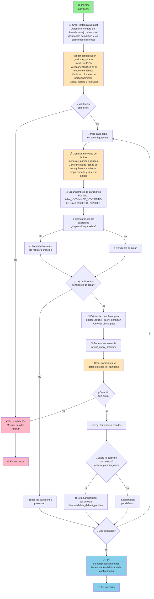

# NB_PAR_PARTITIONER

[](https://www.python.org/)

## 📋 Resumen

El cuaderno **NB_PAR_PARTITIONER** es responsable de la **creación de particiones en modelos semánticos de Power BI**. Valida la configuración de particionamiento proporcionada por el usuario, genera automáticamente los intervalos de fechas necesarios y crea las particiones en el modelo semántico especificado.

---

## ➡️ Parámetros de entrada

| Parámetro | Tipo | Descripción | Ejemplo |
|-----------|------|-------------|---------|
| `workspace_id` | string | GUID del área de trabajo de Microsoft Fabric | `"dc1b17ac-1d39-4be3-a848-45c8a55c05f1"` |
| `dataset_id` | string | GUID del modelo semántico de Power BI | `"0e4e85ca-f446-44b6-bf18-2a9114668242"` |
| `partitions_config` | string (JSON) | Configuración de particiones a crear | Ver tabla abajo |

**Ejemplo de `partitions_config`:**
```json
[
  {
    "table": "Sales",
    "first_date": "20200101",
    "partition_by": "Order Date",
    "interval": "QUARTER"
  },
  {
    "table": "Customer",
    "first_date": "20200101",
    "partition_by": "Create Date",
    "interval": "YEAR"
  }
]
```

| Campo | Tipo | Descripción | Ejemplo |
|-------|------|-------------|---------|
| `table` | string | Nombre de la entidad del modelo semántico a particionar | `"Sales"` |
| `first_date` | string | Fecha inicial de particionamiento (formato YYYYMMDD) | `"20200101"` |
| `partition_by` | string | Nombre de la columna de fecha para particionar | `"Order Date"` |
| `interval` | string | Intervalo de particionamiento | `MONTH`, `QUARTER`, `YEAR` |

El cuaderno valida automáticamente:
- ✅ Que todas las entidades en `partitions_config` existan en el modelo semántico
- ✅ Que todas las columnas `partition_by` sean válidas
- ✅ Que `first_date` esté en formato YYYYMMDD
- ✅ Que `interval` sea un valor válido (`MONTH`, `QUARTER` o `YEAR`)

---

## 🔄 Flujo de acciones



---

## 📦 Dependencias

### Bibliotecas externas

- **pandas**: Manipulación de DataFrames
- **datetime**: Cálculos de fechas
- **typing**: Tipos (Dict, List)
- **logging**: Sistema de logging
- **json**: Manejo de estructuras JSON

### fabtoolkit

Conjunto de utilidades personalizadas para facilitar operaciones comunes en Microsoft Fabric.

```python
from fabtoolkit.utils import (
    generate_date_ranges,     # Generar intervalos de fechas
    Constants,                # Constantes globales (DATE_FORMAT, INTERVALS)
    Interval                  # Enum de intervalos válidos
)
from fabtoolkit.log import ConsoleFormatter    # Formato de logging personalizado
from fabtoolkit.dataset import Dataset         # Clase para operaciones sobre modelos semánticos
```

**Versión de fabtoolkit:** `1.0.0`

---

## Ejemplos de uso

### Ejemplo 1: Particionar una tabla por trimestre

```json
[
  {
    "table": "Sales",
    "first_date": "20200101",
    "partition_by": "Order Date",
    "interval": "QUARTER"
  }
]
```

**Resultado esperado (a 27/12/2025):**
```
Sales_20200101_20200331  (Q1 2020)
Sales_20200401_20200630  (Q2 2020)
Sales_20200701_20200930  (Q3 2020)
... (continúa hasta Q4 2025)
Sales_20251001_20251231  (Q4 2025)
```

### Ejemplo 2: Múltiples entidades con diferentes intervalos

```json
[
  {
    "table": "Sales",
    "first_date": "20200101",
    "partition_by": "Delivery Date",
    "interval": "QUARTER"
  },
  {
    "table": "Orders",
    "first_date": "20250101",
    "partition_by": "Order Date",
    "interval": "MONTH"
  }
]
```

---

## 📝 Notas de implementación

### Generación de intervalo de fechas

- El intervalo se calcula hasta el **último día del período actual**:
  - Si el intervalo es `YEAR`: hasta el final del año actual
  - Si el intervalo es `QUARTER`: hasta el final del trimestre actual
  - Si el intervalo es `MONTH`: hasta el final del mes actual

### Eliminación de partición por defecto

- Generalmente, por defecto, Power BI crea una partición que abarca todos los datos, cuyo nombre coincide con la entidad
- Una vez añadidas las particiones necesarias, esta partición se elimina en caso de que exista

### Construcción de consultas M para particiones

- Se preserva la consulta original (transformaciones, uniones, etc.)
- Se agrega un paso adicional `Table.SelectRows` para filtrar por un intervalo de fechas específico

---