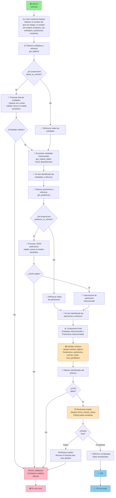

# NB_PAR_REFRESHER

[](https://www.python.org/)

## 📋 Resumen

El cuaderno **NB_PAR_REFRESHER** es responsable de la **ejecución controlada de refrescos de datos en modelos semánticos de Power BI**. Permite a los usuarios especificar entidades y particiones concretas para refrescar, optimizando así el uso de recursos y reduciendo los tiempos de actualización al evitar refrescos completos innecesarios.

---

## ➡️ Parámetros de entrada

### Configuración básica

| Parámetro | Tipo | Descripción | Ejemplo |
|-----------|------|-------------|---------|
| `workspace_id` | string | GUID del área de trabajo de Microsoft Fabric | `"dc1b17ac-1d39-4be3-a848-45c8a55c05f1"` |
| `dataset_id` | string | GUID del modelo semántico de Power BI | `"0e4e85ca-f446-44b6-bf18-2a9114668242"` |

### Parámetros de refresco

| Parámetro | Tipo | Descripción | Ejemplo | Por defecto |
|-----------|------|-------------|---------|-------------|
| `tables_to_refresh` | string | Entidades a refrescar (separadas por comas) | `"Customer,Sales"` | Todas las entidades |
| `partitions_to_refresh` | string (JSON) | Particiones específicas a refrescar | Ver tabla abajo | Todas las particiones |
| `commit_mode` | string | Confirmación de transacciones | `"transactional"`, `"partialBatch"` | `"transactional"` |
| `max_parallelism` | integer | Número máximo de entidades a refrescar en paralelo | `6` | `4` |

#### `tables_to_refresh`

- **Formato:** Cadena con nombres de entidades separados por comas

  ```plaintext
  "Sales,Customer,Products"
  ```

- **Comportamiento:**
  - Si se proporciona un valor válido, refresca solo dichas entidades junto a sus dependencias
  - Si está vacío, refresca todas las entidades del modelo semántico

#### `partitions_to_refresh`

- **Formato:** JSON de entidades y particiones a refrescar 

```json
[
  {
    "table": "Sales",
    "selected_partitions": ["Sales_20250101_20250331", "Sales_20250401_20250630"]
  },
  {
    "table": "Orders",
    "selected_partitions": ["Orders_20250101_20251231"]
  }
]
```

- **Comportamiento:**:
  - Si se proporciona un valor válido, refresca solo las particiones especificadas
    - Si una entidad aparece en el parámetro `tables_to_refresh` pero no en `partitions_to_refresh`, se refrescan todas sus particiones
    - Si una entidad aparece en el parámetro `partitions_to_refresh`, se refrescan solo las particiones listadas
  - Si está vacío, refresca todas las particiones de las entidades seleccionadas
---

## 🔄 Flujo de acciones



---

### Bibliotecas externas

- **pandas**: Manipulación de DataFrames
- **datetime**: Cálculos de fechas
- **typing**: Tipos (List, Optional)

### fabtoolkit

Conjunto de utilidades personalizadas para facilitar operaciones comunes en Microsoft Fabric.

```python
from fabtoolkit.utils import (
    is_valid_text          # Validar string no vacío
)
from fabtoolkit.log import ConsoleFormatter    # Formato de logging personalizado
from fabtoolkit.dataset import Dataset         # Clase para operaciones sobre modelos semánticos
```

---

## Ejemplos de uso

### Ejemplo 1: Refrescar todas las entidades y particiones

```python
tables_to_refresh = None
partitions_to_refresh = None
commit_mode = "transactional"
max_parallelism = 4
```

### Ejemplo 2: Refrescar solo una entidad y todas sus particiones

```python
tables_to_refresh = "Sales"
partitions_to_refresh = None
commit_mode = "transactional"
max_parallelism = 4
```

### Ejemplo 3: Refrescar solo una entidad y particiones específicas

```python
tables_to_refresh = "Sales"
partitions_to_refresh = '[
  {
    "table": "Sales",
    "selected_partitions": ["Sales_20250101_20250331", "Sales_20250401_20250630"]
  }
]'
commit_mode = "transactional"
max_parallelism = 4
```

---

## 📝 Notas de implementación

### Búsqueda de entidades relacionadas
```python
dataset.get_related_tables(["Sales"])
# Devuelve: [Sales, Customer, Product, Store, etc.]
# Todas las entidades con relaciones directas/indirectas
```

---